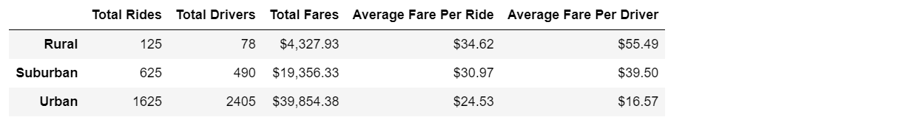
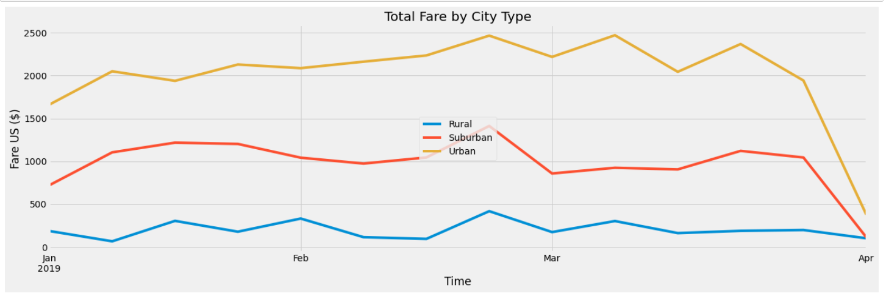

# PyBer_Analysis
# Overview

  The purpose for this analysis was to determine how the number of rides, total fares, average fare per ride, per driver differs in different types of cities.
  These types are - Urban, Suburban an Rural.

# Results: 
  Using images from the summary DataFrame and multiple-line chart, describe the differences in ride-sharing data among the different city types.

    As we can see, from the following, the Urban cities have most number of rides
  	Rural        125
	  Suburban     625
	  Urban       1625

    And same goes for number of drivers in the cities
	  Rural         78
	  Suburban     490
	  Urban       2405

  Also as seen in the image below, Urban cities has the lowest fares, be it Average per ride or Average per driver.
  
  
# Summary:
  
  
   Eventhough the numbers looks pretty normal, following recommendations may help
 
 	  ## Recommendations:-
	
		* In Rural cities, where the number of drivers is pretty low, if some incentives are announced, it can    be helpful in increasing that number.
		* In Rural cities, the Average Fare per driver is the highest. So if it is be reduced (some scheme), people will be using more rides.
		* For all the city types, fare is max at last week of February 2019, so to bring it down, number of drivers can be increased. 

